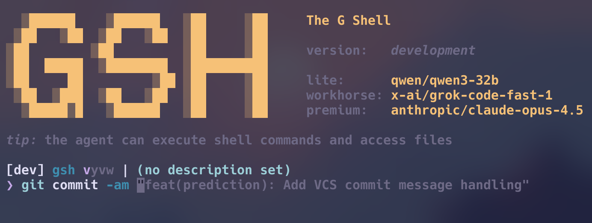

# gsh

[](https://github.com/atinylittleshell/gsh/blob/main/LICENSE)
[](https://github.com/atinylittleshell/gsh/releases)
[](https://github.com/atinylittleshell/gsh/actions)
[](https://codecov.io/gh/atinylittleshell/gsh)

<p align="center">
    
</p>

<p align="center">
A battery-included, POSIX-compatible, <ins>G</ins>enerative <ins>Sh</ins>ell.
</p>

## Key features

- **POSIX-compatible REPL**: you don't need to completely change how you use your shell
- **Battery included**: basic stuff like command history, auto suggestion, and syntax highlighting work out of the box
- **Built-in agents**: agents are first-class citizens in gsh, allowing you to interact with your shell using natural language
- **Model agnostic**: you can use any LLM provider or model you like, including local LLMs
- **Full customizability**: Inspired by the Neovim ecosystem, gsh allows you to customize and extend every aspect of your shell experience using gsh scripts
- **Agentic scripting language**: gsh scripts allow you to easily compose intelligent agents and deterministic workflows

### Generative suggestion of shell commands

gsh will automatically complete the next command you're likely to run based on your context and history.



### Agent chat

Chat with AI agents directly in your shell using the `#` prefix:

```bash
gsh> # look at my unstaged changes and write test cases for them
```

Agents can:

- Run shell commands and analyze output
- Search, read and modify files
- Use custom MCP servers
- Maintain conversation context across multiple turns

See the complete guide: [Agents in the REPL](docs/tutorial/06-agents-in-the-repl.md)

### Agentic scripting language

Compose intelligent agents and deterministic workflows using the gsh scripting language.

```gsh
#!/usr/bin/env gsh

# Generate a commit message from staged changes
agent CommitWriter {
    model: gsh.models.workhorse,
    systemPrompt: "Write concise, conventional commit messages. Output only the message.",
}

diff = exec("git diff --cached")
if (diff.stdout == "") {
    print("No staged changes")
} else {
    result = diff.stdout | CommitWriter
    print(result.lastMessage.content)
}
```

### External agents

gsh can delegate to powerful external agents via the Agent Client Protocol (ACP).

```gsh
# ~/.gsh/repl.gsh

acp ClaudeCode {
  command: "npx",
  args: ["-y", "@zed-industries/claude-code-acp"],
}

__claudeCodeSession = null

tool mentionClaude(ctx, next) {
  if (ctx.input.includes("@claude")) {
    if (__claudeCodeSession == null) {
      __claudeCodeSession = ctx.input | ClaudeCode
    } else {
      __claudeCodeSession = __claudeCodeSession | ctx.input
    }

    return { handled: true }
  }

  return next(ctx)
}

gsh.use("command.input", mentionClaude)
```

You will then be able to invoke Claude Code directly in gsh using the `@claude` keyword:

```bash
gsh> @claude Please analyze the current directory and suggest improvements.
```

### Supports local and remote LLMs

gsh can run with either

- Local LLMs through [Ollama](https://ollama.com/)
- Or remote LLMs through an OpenAI API-compatible endpoint, such as [OpenRouter](https://openrouter.ai/)

## Installation

See the [Getting Started Guide](docs/tutorial/01-getting-started-with-gsh.md#installation).

## Documentation

- **[Tutorial](docs/tutorial/README.md)** - Complete guide to getting started with gsh
- **[Language Reference](docs/script/01-introduction.md)** - gsh scripting language documentation
- **[SDK Reference](docs/sdk/README.md)** - gsh SDK object and API documentation

## Telemetry

gsh collects anonymous usage statistics to help improve the product.

### What We Collect

- gsh version, OS, CPU architecture
- Session start/end and duration
- Script execution counts
- Error categories (e.g., "parse_error", not error messages)
- Startup time

### What We NEVER Collect

- Commands, prompts, or any user input
- File paths or filenames
- API keys or environment variables
- MCP server names, URLs, or configurations
- Error messages or stack traces
- Any personally identifiable information

### Opting Out

You can opt out of telemetry at any time:

```bash
# Check current status
gsh telemetry status

# Disable telemetry
gsh telemetry off

# Re-enable telemetry
gsh telemetry on

# Or use environment variable
export GSH_NO_TELEMETRY=1
```

## Status

This project is in early development stage. Use at your own risk! Please expect bugs, incomplete features, and breaking changes. The v1.0 version number reflects our first major breaking change, not stability—we follow [Semantic Versioning](https://semver.org/).

That said, if you try it out and provide feedback, that would help make gsh more useful!

If you're upgrading from v0.x, note that configuration has changed since v1.0:

- **New:** `~/.gsh/repl.gsh` for gsh-specific features (models, agents, prompts, middleware)
- **Updated:** `~/.gshrc` still works as a POSIX-compatible config file, but it no longer includes gsh-specific features

## Roadmap

See [ROADMAP.md](./ROADMAP.md) for what's planned.
Feel free to suggest new features by opening an issue!

## Acknowledgements

gsh is built on top of many great open source projects. Most notably:

- [mvdan/sh](https://github.com/mvdan/sh) - A shell parser, formatter, and interpreter
- [bubbletea](https://github.com/charmbracelet/bubbletea) - A powerful little TUI framework
- [zap](https://github.com/uber-go/zap) - Blazing fast, structured, leveled logging in Go

## Like This Project?

[](https://www.buymeacoffee.com/onelittleshell)
